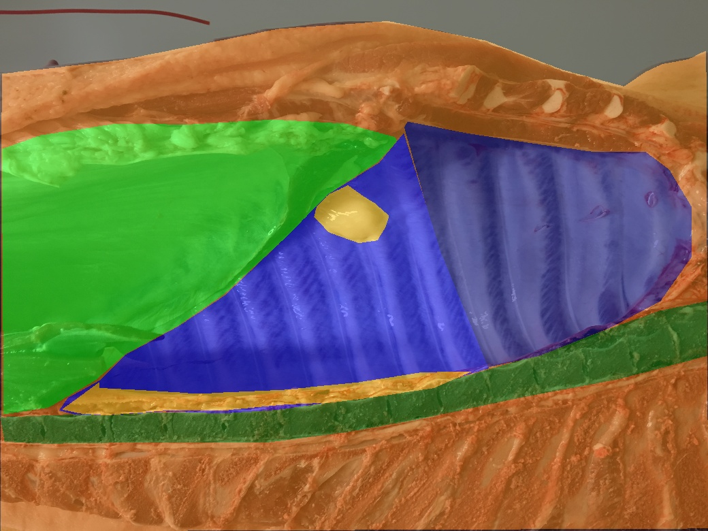
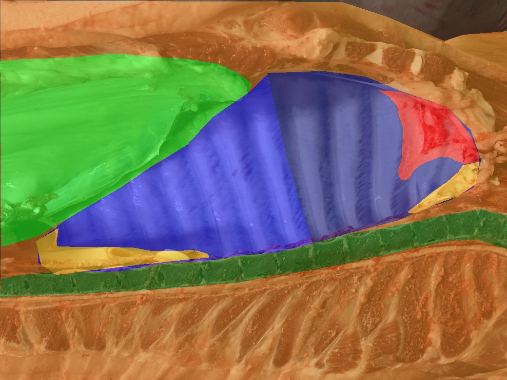
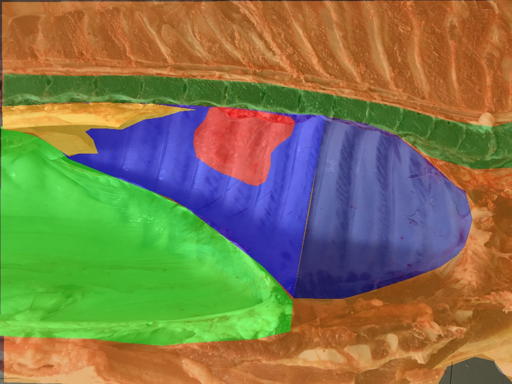
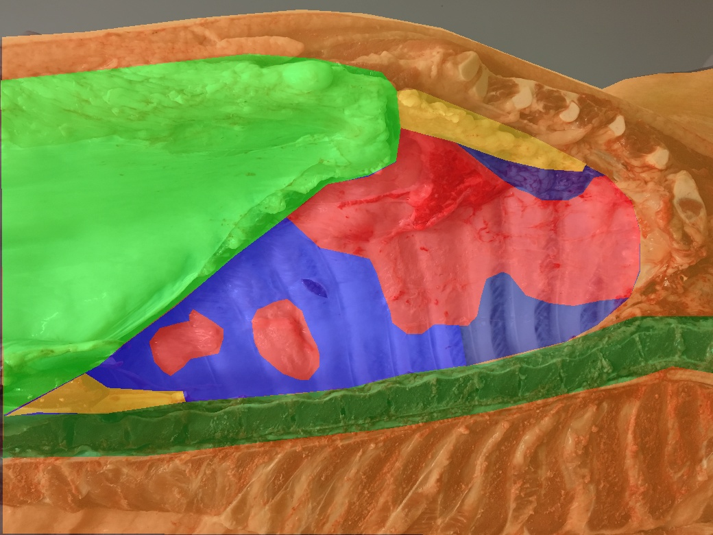

# Segmentation Guided Scoring of Pathological Lesions in Swines Through Convolutional Neural Networks (ID: 34)
Code and Dataset
# Code
Still to come

# Dataset
## Test Set
Test set with 200 examples (50 for each class) is available with no restrictions [HERE]()
Each example comprises:
- An RGB image (.jpg) with shape WxH
- A stacked segmentation (.npy) with shape WxHxC, where C is the number of segmnetation classes
  
Labels for the pleurisy score Task are available in the ```raw_labels.txt``` file.
Examples from the 4 classes are reported:

<table style="width:100%">
    <tr>
        <th>
            <p align="center">
            
            <br>Class 0 example.
            </p>
        </th>
        <th>
            <p align="center">
            
            <br>Class 1 example.
            </p>
        </th>
     </tr>
 </table>

<table style="width:100%">
    <tr>
        <th>
            <p align="center">
            
            <br>Class 2 example.
            </p>
        </th>
        <th>
            <p align="center">
            
            <br>Class 3 example.
            </p>
        </th>
     </tr>
 </table>


## Train Set
Train set is available upon request.
